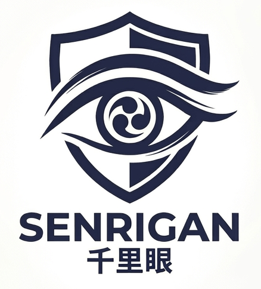

 

    
 

 <h1>Senrigan</h1>

 

   <b>Offline, open-source AWS CloudTrail DFIR &amp; threat hunting platform.</b> 
   By <a href="https://github.com/Yamato-Security">Yamato Security</a> — 120+ built-in hunts, 100+
   Superset dashboard charts, AI chat, and an AWS Config resource graph, all on your laptop with a
   single <code>make up</code>.
 

 

    
    
    
    
    
    
    
    
 

 <h2>
   📖 <a href="https://yamato-security.github.io/senrigan/">Read the Documentation&nbsp;→</a>
 </h2>

 
   Available in 15 languages — English · 日本語 · 繁體中文 · 한국어 · Deutsch · Türkçe · Français ·
   Español · Português (Brasil) · Українська · हिन्दी · Bahasa Indonesia · မြန်မာဘာသာ · ไทย · العربية
 

---

## 🦅 About

Senrigan is an **offline, open-source AWS CloudTrail DFIR & threat hunting platform**. Drop in your
CloudTrail logs and get **120+ ready-to-run threat hunts**, **100+ pre-built Apache Superset dashboard
charts**, AI-assisted chat analysis,
HTML threat-hunting reports, and an AWS Config resource graph — all on your laptop with
a single `make up`. **No SIEM required, no cloud infrastructure needed.**

## 📖 Documentation

All documentation now lives on a dedicated, searchable, multi-language site:

> ### 👉 **[yamato-security.github.io/senrigan](https://yamato-security.github.io/senrigan/)**

| Section |                                               |
| --- |-----------------------------------------------|
| 🚀 [Getting Started](https://yamato-security.github.io/senrigan/getting-started/) | Prerequisites, quick start with Docker        |
| 🔎 [Reference](https://yamato-security.github.io/senrigan/reference/) | 120+ built-in hunts and 100+ dashboard charts |
| 🧩 [Modules](https://yamato-security.github.io/senrigan/overview/modules/) | ingester, agent, dashboard, config_viz        |
| 🏛️ [Architecture](https://yamato-security.github.io/senrigan/overview/architecture/) | How it all fits together                      |

## 🗂️ Looking for the old README?

The previous single-page README is preserved unchanged:

- 📄 [**OLD-README.md**](OLD-README.md)

## 📜 License

Senrigan is released under the [GNU AGPLv3](LICENSE) license.

---

  Made with 🦅 by <a href="https://github.com/Yamato-Security">Yamato Security</a>
  &nbsp;·&nbsp; <a href="https://twitter.com/SecurityYamato">@SecurityYamato</a>

