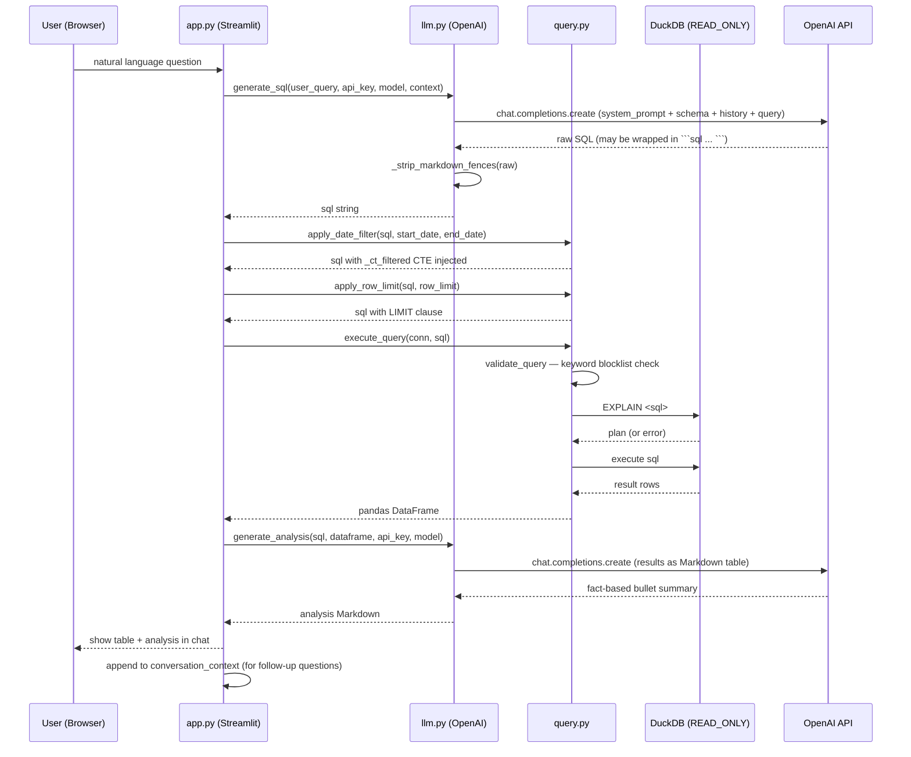
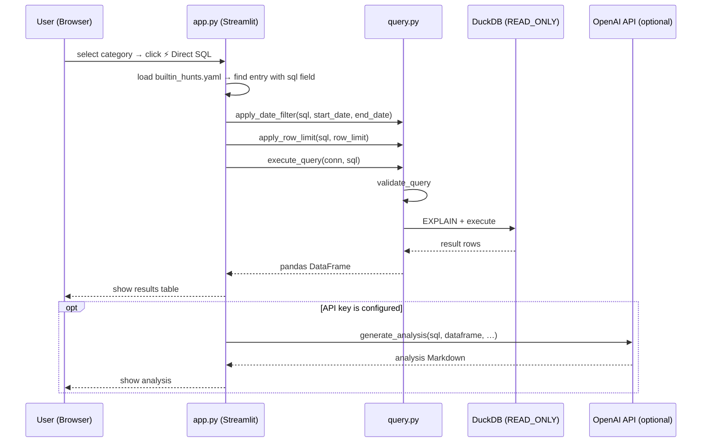
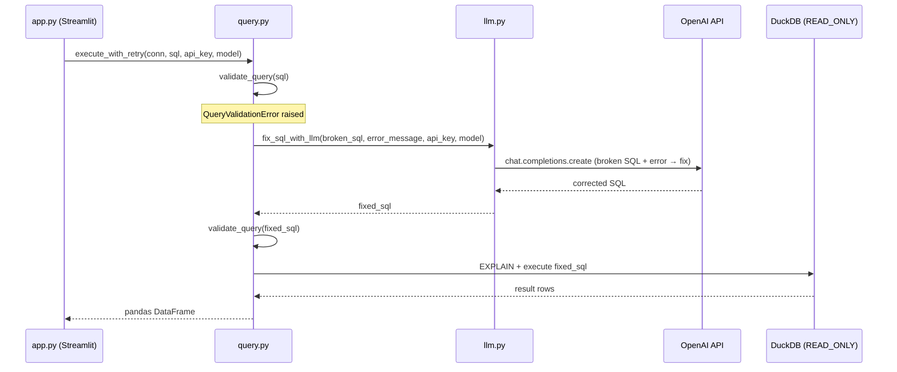

# agent

AI-assisted threat hunting module for Senrigan.

Enter a natural language question → OpenAI generates DuckDB SQL → safety guards validate the query
→ results are executed against the CloudTrail log database → AI delivers a fact-based threat analysis summary.
DuckDB is always opened in **`READ_ONLY`** mode.

---

## Table of Contents

- [Quick Start](#quick-start)
- [How It Works](#how-it-works)
  - [Sequence Diagram — AI Query Flow](#sequence-diagram--ai-query-flow)
  - [Sequence Diagram — Direct SQL (Built-in Hunt)](#sequence-diagram--direct-sql-built-in-hunt)
  - [Sequence Diagram — SQL Fix Retry](#sequence-diagram--sql-fix-retry)
- [SQL Safety Guards](#sql-safety-guards)
- [Date-Range Filter](#date-range-filter)
- [Built-in Hunts](#built-in-hunts)
- [Suzaku Timeline Page](#suzaku-timeline-page)
- [Report Generation](#report-generation)
- [Module Structure](#module-structure)
- [Configuration](#configuration)
- [Development](#development)

---

## Quick Start

```bash
# Run from docker/
docker compose up -d agent

# Open the UI
open http://localhost:8501
```

`OPENAI_API_KEY` is required for AI SQL generation and analysis.
Built-in hunts with a `sql` field can be executed without an API key.

---

## How It Works

### Sequence Diagram — AI Query Flow

The main flow: a user asks a natural language question and the agent
generates, validates, executes, and analyses a SQL query.



---

### Sequence Diagram — Direct SQL (Built-in Hunt)

Built-in hunts that have a pre-written `sql` field bypass the OpenAI
SQL generation step entirely.



---

### Sequence Diagram — SQL Fix Retry

When generated SQL fails validation, the agent automatically asks the LLM
to fix it (up to one retry).



---

## SQL Safety Guards

Before executing any LLM-generated SQL, `query.py` applies three guards in order:

| Guard | Mechanism | Rejects |
|-------|-----------|---------|
| **Keyword blocklist** | Regex word-boundary match (case-insensitive) | `INSERT`, `UPDATE`, `DELETE`, `DROP`, `ALTER`, `CREATE` |
| **EXPLAIN validation** | Runs `EXPLAIN <sql>` on the READ_ONLY connection | Syntactically invalid SQL |
| **Row-limit cap** | Wraps queries without `LIMIT` in `SELECT * FROM (…) AS _limited LIMIT N` | Unbounded result sets |

If validation fails, `execute_with_retry` calls `fix_sql_with_llm` once to attempt
an automatic correction. If the fixed SQL also fails, a `QueryValidationError` is surfaced
to the user.

Queries always execute against a **READ_ONLY** DuckDB connection — write operations
are impossible at the connection level even if a query bypassed the keyword filter.

---

## Date-Range Filter

The sidebar exposes **From** / **To** date pickers. When set, `apply_date_filter()`
injects a `_ct_filtered` CTE that wraps `cloudtrail_events` with the selected
`event_time` bounds, then replaces every reference to `cloudtrail_events` in the
original SQL with `_ct_filtered`.

```sql
-- Example: user selects 2024-01-01 → 2024-01-31
WITH _ct_filtered AS (
    SELECT * FROM cloudtrail_events
    WHERE event_time >= TIMESTAMP '2024-01-01 00:00:00'
      AND event_time <= TIMESTAMP '2024-01-31 23:59:59'
)
-- original query follows, with cloudtrail_events replaced by _ct_filtered
SELECT event_name, COUNT(*) FROM _ct_filtered GROUP BY 1 ORDER BY 2 DESC
```

Existing `WITH` chains are extended correctly — no duplicate `WITH` keyword is emitted.

---

## Built-in Hunts

`builtin_hunts.yaml` ships categorised threat hunting queries.

Each entry has:

| Field | Required | Description |
|-------|----------|-------------|
| `label` | Yes | Short display name shown in the sidebar |
| `description` | Yes | One-line description of the hunt |
| `prompt` | Yes | Natural language prompt sent to the LLM |
| `sql` | No | Pre-written SQL; when present, no API key is needed |

- Entries **with** `sql` → **Direct SQL** button is shown; executes immediately without OpenAI.
- Entries **without** `sql` → **Ask AI** button only; requires `OPENAI_API_KEY`.

---

## Suzaku Timeline Page

The app has two pages, selected in the sidebar navigation:

| Page | Table | Data source |
|------|-------|-------------|
| 🔭 **Senrigan** | `cloudtrail_events` | `threat_hunting.db`, written by the ingester |
| 🕒 **Suzaku Timeline** | `timeline` | a `*.duckdb` file produced by [Suzaku](https://github.com/Yamato-Security/suzaku) |

Both pages run the same machinery — built-in hunts, date range, result filters,
AI chat, AI analysis, Markdown/HTML report, session export — driven by a
`DatasetProfile` (`profiles.py`) that describes the table. Their session state is
namespaced separately, so an investigation on one page is never disturbed by the
other; the API key, model and row cap are shared.

### Setting it up

```bash
# 1. Run Suzaku, writing DuckDB output
suzaku aws-ct-timeline -d <cloudtrail-logs> -o timeline.duckdb

# 2. Copy the result next to Senrigan's own database
cp timeline.duckdb docker/data/db/

# 3. Reload the page (or `make up`)
```

The file name does not matter: the producing Suzaku command is detected from the
schema (`suzaku_db.py`). Several timeline files can coexist — the sidebar lists
them newest-first, and `SUZAKU_TIMELINE_DB` pins a specific one.

Copy the file only after Suzaku has exited. A leftover `.wal` cannot be replayed
from the read-only mount the container uses, and the database will not open; the
page says so explicitly when it detects one.

### What is different about this page

Suzaku's schema forces four deviations, all handled by the profile
(see [doc/PLAN_SUZAKU_SCHEMA.md](../doc/PLAN_SUZAKU_SCHEMA.md) for the upstream
proposal that would remove them):

- **Severity filter** — `low` and `informational` are ~87% of a real timeline, so
  the sidebar defaults to `critical` / `high` / `medium`. Without it the page
  shows noise.
- **Quoted identifiers** — columns are PascalCase and `AWS-Region` is hyphenated,
  so generated SQL always double-quotes them.
- **`CAST` on the timestamp** — `Timestamp` is VARCHAR, so the date filter casts it.
- **No geo enrichment** — the timeline table has no `geo_*` columns, so the
  sidebar toggle is hidden rather than silently doing nothing.

`aws-ct-summary` and `aws-ct-metrics` are intentionally *not* pages here: Suzaku
has already aggregated them, so they are served by the
[dashboard module](../dashboard/README.md) instead.

## Report Generation

After one or more queries, the **Download Report** button in the sidebar
generates a Markdown report via `report.py`:

- Each query result is captured as a `ReportEntry` (question, SQL, result table, analysis).
- Sensitive values (ARNs, account IDs, IP addresses) are partially redacted.
- The final report includes a header, timestamp, all query entries, and a summary section.

---

## Module Structure

```
agent/
├── app.py                 # Streamlit entry point — UI layout, session state, event loop
├── llm.py                 # OpenAI API integration (SQL generation, analysis, SQL fix)
├── query.py               # Query execution, validation, date filter, row limit, retry
├── report.py              # Report generation (Markdown + sensitive data redaction)
├── schema.py              # Column metadata for both tables (system prompt input)
├── profiles.py            # DatasetProfile — per-table config for the shared pipeline
├── suzaku_db.py           # Discovery + schema-based detection of Suzaku DuckDB files
├── config.py              # Configuration management (env vars)
├── builtin_hunts.yaml     # Pre-built CloudTrail hunts (categorised)
├── suzaku_timeline_hunts.yaml  # Pre-built Suzaku timeline hunts (15, categorised)
├── views/
│   └── suzaku_timeline.py # Streamlit page for Suzaku aws-ct-timeline output
├── prompts/
│   ├── system_prompt.py   # System prompt template for cloudtrail_events
│   └── suzaku_timeline_prompt.py  # System prompt template for Suzaku's timeline
├── requirements.txt
├── requirements-dev.txt
├── Dockerfile
└── tests/
    ├── conftest.py        # Shared fixtures: mock_openai_client, tmp_duckdb
    ├── test_config.py
    ├── test_schema.py
    ├── test_query.py
    ├── test_llm.py
    ├── test_report.py
    ├── test_app.py
    ├── test_profiles.py
    ├── test_suzaku_db.py
    ├── test_suzaku_timeline_hunts.py
    ├── test_suzaku_timeline_view.py
    └── test_result_card_charts.py
```

## Configuration

| Variable | Required | Default | Description |
|----------|----------|---------|-------------|
| `OPENAI_API_KEY` | Yes (AI features) | — | OpenAI API key |
| `DUCKDB_PATH` | Yes | — | Path to DuckDB file |
| `OPENAI_MODEL` | No | `gpt-5.4` | Model for SQL generation + analysis |
| `OPENAI_MODEL_LITE` | No | `gpt-5.4-mini` | Lighter model (optional override) |
| `SSL_CERT_FILE` / `REQUESTS_CA_BUNDLE` | No | — | CA bundle for corporate TLS proxy |
| `SUZAKU_TIMELINE_DB` | No | — | Pin one Suzaku timeline file instead of auto-detecting |

---

## Development

```bash
cd agent
pip install -r requirements.txt -r requirements-dev.txt

pytest                                        # Run all tests
pytest -v --tb=short                          # Verbose output
pytest --cov=. --cov-report=term-missing      # With coverage
ruff check .                                  # Lint
black .                                       # Format
```

### Testing notes

- All tests that touch `llm.py` must mock `llm.OpenAI` (not `agent.llm.OpenAI`).
  `pytest.ini` sets `pythonpath = .`, so modules resolve as top-level names.
- DuckDB connections in tests use the `tmp_duckdb` fixture from `conftest.py`
  (`tmp_path / "test.db"`), never a shared file.
- Real OpenAI API calls in tests are **forbidden** — use `mock_openai_client`.

