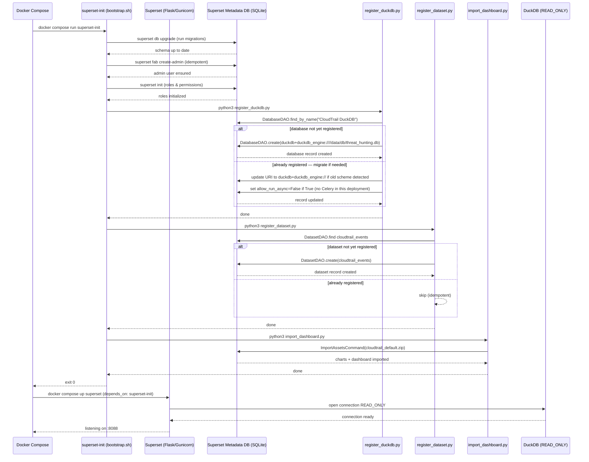
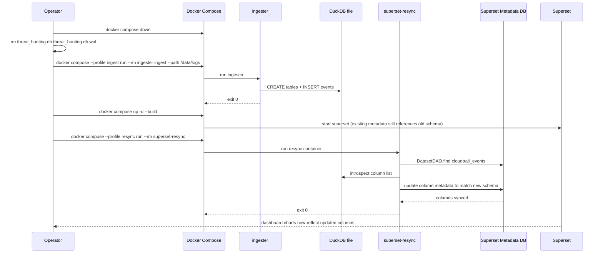

# dashboard

BI dashboard module for Senrigan powered by Apache Superset.
Visualizes CloudTrail log data — and Suzaku Sigma-rule detections — stored in DuckDB.
Always opens DuckDB in **`READ_ONLY`** mode.

---

## Table of Contents

- [Quick Start](#quick-start)
- [Initialization Flow](#initialization-flow)
  - [Sequence Diagram — First Startup](#sequence-diagram--first-startup)
  - [Sequence Diagram — Re-ingest & Resync](#sequence-diagram--re-ingest--resync)
- [Pre-built Charts](#pre-built-charts)
  - [Rare Events dashboard](#rare-events-dashboard)
  - [Suzaku Detections dashboard](#suzaku-detections-dashboard)
- [Directory Structure](#directory-structure)
- [Configuration](#configuration)
- [Development](#development)
- [Troubleshooting](#troubleshooting)

---

## Quick Start

```bash
# Run from docker/

# 1. (First time) Ingest logs
docker compose --profile ingest run --rm ingester ingest --path /data/logs

# 2. Start the dashboard
docker compose up -d superset
```

Open http://localhost:8088 (default credentials: `admin` / `admin`).

> **Security:** Set `SUPERSET_SECRET_KEY` before starting Superset (or run `make ensure-secret`, which writes a per-install key to `docker/.env`). Change the admin password before exposing
> the service outside localhost.

---

## Initialization Flow

On first startup, the `superset-init` service runs automatically before
`superset` is started. All steps are **idempotent** — safe to re-run.

### Sequence Diagram — First Startup



---

### Sequence Diagram — Re-ingest & Resync

After re-ingesting logs from scratch, the dashboard's column metadata
may go stale. The `superset-resync` profile re-syncs the dataset.



---

## Pre-built Charts

The `cloudtrail_default.zip` import bundle contains **73 charts** across 9 tabs.

| Tab | Charts | Key Content |
|-----|:------:|-------------|
| 🔑 Identity & Access | 11 | Console logins · MFA trend · login heatmap · root usage · IAM entity activity · privilege escalation · Glue/SageMaker privesc · AssumedRole from external IP · secrets access anomaly · sensitive APIs · SSO events |
| 🎯 Threat Detection | 9 | Defense evasion · VPC flowlog/Config tampering · EventBridge/CloudWatch tampering · WAF changes · Org/SCP changes · error trend · throttling spikes · event timeseries |
| 📊 API Activity | 5 | Top API calls · access denied actions · region activity · source IPs · user agents |
| 🌐 Network | 5 | Security group changes · NACL/route table changes · VPC infrastructure · VPC peering/Transit Gateway · Route53 DNS changes |
| 🖥️ Computing | 13 | EC2 launches · mass stop/terminate · key pair · instance profile · user data · public snapshot · spot fleet abuse · ECS task definition backdoor · Lambda backdoor · SSM execution · EBS direct API · EKS/ECR events · CloudFormation changes |
| 🪣 S3 & RDS | 11 | S3 bulk download/deletion · versioning/logging disabled · cross-account replication · bucket policy · list recon · protection config · AWS Backup tampering · KMS key destruction · RDS snapshot share · RDS deleted without snapshot |
| 🌍 GeoIP Intelligence | 4 | World map · top countries/cities/ASNs (requires MaxMind GeoLite2) |
| 🕒 Temporal Analysis | 7 | Velocity spikes · dormant accounts reactivated · first/last seen per identity/IP/API/user-agent/service source |
| 🚨 High-Risk API Monitor | 7 | HRM timeseries · top calls/actors/IPs · by region · defense evasion table · credential access table |
All charts are backed by the `cloudtrail_events` dataset and respect
Superset's native time-range and filter bar controls.

### Rare Events dashboard

A second dashboard, **CloudTrail Threat Hunting — Rare Events**
(`cloudtrail_rare.zip`), mirrors the exact tab/chart layout of the default
**CloudTrail Threat Hunting — Top Events** dashboard but flips every frequency-ranked chart to **ascending (bottom-N)
order**, surfacing the least frequent — and therefore potentially most
anomalous — values. It is generated from `cloudtrail_default/` by
`assets/rebuild_rare_zip.py` (never edited by hand): chart/dashboard uuids
are derived deterministically via `uuid5`, slice names get a ` (Rare)`
suffix, and charts without an ordering knob (KPI cards, timeseries, world
map, heatmap) are mirrored unchanged. Both dashboards share the same
database and dataset objects.

### Suzaku Detections dashboard

A third dashboard, **Suzaku Detections** (`suzaku_detections.zip`), visualises the
Sigma-rule detections produced by
[Suzaku](https://github.com/Yamato-Security/suzaku). Where the CloudTrail
dashboards show *everything that happened*, this one shows *what a detection
rule flagged* — and answers, in tab order, the questions an analyst asks of a
detection set:

| Tab | Charts | Key Content |
|-----|:------:|-------------|
| 🔎 Overview | 12 | 8 triage KPIs (total · critical+high · rules · principals · IPs · countries · accounts · active days) · detections over time by severity · severity breakdown · top rules · the event-level detection timeline |
| 📜 Rules | 6 | Rule summary with blast radius · rule activity over time · **rare rules** (ascending — the one-off hit is usually the real one) · rule authors · rule_id catalog for looking rules up in suzaku-rules · newly firing rules |
| 🎯 MITRE ATT&CK | 9 | Tactic & technique distribution · tactics over time (the kill chain) · tactic × severity · technique → rule bridge · tactic × principal · attributed threat groups · 2 coverage KPIs |
| 👤 Identity | 8 | Top principals · identity types · principal summary · principal × rule matrix · **access keys to rotate** · top and rare user agents · per-account rollup |
| 🌍 Origin | 7 | World map · top countries · top ASNs · source IPs with geo context · AWS region activity · country × severity · country × rule |
| ⏱ Timeline | 6 | Hour × day-of-week heatmap · detections by hour · 5-minute burst view (automation detection) · daily severity trend · first/last seen per principal and per source IP |
| 🧩 Events | 8 | Top API actions · services/workloads · success vs failure · error codes · action × rule matrix · Azure/M365 workload activity · import provenance · full detection detail |

The data comes from two datasets written by `ingester suzaku-import`:
`suzaku_detections` (one row per rule hit) and `suzaku_detection_tags` (one row
per ATT&CK tag, which is what makes clean per-tactic and per-technique charts
possible). Both live in the same DuckDB file as `cloudtrail_events` and reuse
the same "CloudTrail DuckDB" connection.

Populate them by running Suzaku with DuckDB output and importing the result:

```bash
suzaku aws-ct-timeline -d <logs> -o result -t duckdb --geo-ip <maxmind-db-dir>
cp result.duckdb docker/data/suzaku/
docker compose --profile ingest run --rm ingester suzaku-import --path /data/suzaku
```

Both the AWS (`aws-ct-timeline`) and Azure/Microsoft 365 (`azure-timeline`)
output profiles are supported — the importer resolves their differing column
names into one schema, so the same dashboard works for either. The charts are
empty but render normally before any detections are imported.

---

## Directory Structure

```
dashboard/
├── Dockerfile                          # Extends apache/superset:6.1.0 + duckdb-engine (uv)
├── superset_config.py                  # Superset Flask config (SECRET_KEY, DB URI, dialect registration)
├── assets/
│   ├── cloudtrail_default.zip          # Superset import ZIP (charts + dashboard + dataset)
│   ├── cloudtrail_rare.zip             # Rare Events dashboard ZIP (generated, ascending order)
│   ├── suzaku_detections.zip           # Suzaku Detections dashboard ZIP
│   ├── rebuild_zip.py                  # Regenerate cloudtrail_default.zip from cloudtrail_default/
│   ├── rebuild_rare_zip.py             # Derive cloudtrail_rare.zip from cloudtrail_default/
│   ├── rebuild_suzaku_zip.py           # Regenerate suzaku_detections.zip from suzaku_detections/
│   ├── cloudtrail_default/             # Source-of-truth dashboard definitions
│   │   ├── dashboard.yaml              # 9-tab layout, 72 CHART position entries
│   │   ├── metadata.yaml
│   │   ├── databases/
│   │   │   └── CloudTrail_DuckDB.yaml  # duckdb+duckdb_engine:// URI, allow_run_async: false
│   │   ├── datasets/
│   │   └── charts/                     # 73 chart YAML files (DSH-01 to DSH-78)
│   └── suzaku_detections/              # Suzaku dashboard definitions
│       ├── dashboard.yaml              # 7-tab layout, 56 CHART position entries
│       ├── metadata.yaml
│       ├── databases/                  # Same connection UUID as cloudtrail_default
│       ├── datasets/                   # suzaku_detections + suzaku_detection_tags
│       └── charts/                     # 56 chart YAML files (SZK-01 to SZK-56)
├── init/
│   ├── bootstrap.sh                    # Idempotent init script (runs in superset-init)
│   ├── register_duckdb.py              # Register DuckDB connection; auto-migrates old URI/settings
│   ├── register_dataset.py             # Register all three datasets (CloudTrail + Suzaku)
│   └── import_dashboard.py             # Import a dashboard ZIP via ImportAssetsCommand (DASHBOARD_ZIP env)
└── tests/
    ├── test_chart_yaml.py
    ├── test_dashboard_yaml.py
    ├── test_dockerfile.py
    ├── test_import_dashboard.py
    ├── test_init_scripts.py
    ├── test_rare_generator.py
    ├── test_rare_zip.py
    ├── test_rebuild_zip.py
    ├── test_superset_config.py
    └── test_suzaku_assets.py
```

---

## Configuration

| Variable | Default | Description |
|----------|---------|-------------|
| `SUPERSET_SECRET_KEY` | auto-generated | Session signing key; `make up` generates a per-install value into `docker/.env` (Superset refuses to start without one) |
| `SUPERSET_ADMIN_USERNAME` | `admin` | Admin username |
| `SUPERSET_ADMIN_PASSWORD` | `admin` | Admin password (**must change in production**) |
| `DUCKDB_PATH` | `/data/db/threat_hunting.db` | DuckDB file path (in container) |
| `DUCKDB_HOST_PATH` | `./data/db` | Host-side DuckDB directory (bind mount) |

### Key design decisions

| Setting | Value | Reason |
|---------|-------|--------|
| `allow_run_async` | `False` | No Celery worker in this deployment. `True` causes SQL Lab Issue 1035: *"Failed to start remote query on a worker."* |
| SQLAlchemy URI | `duckdb+duckdb_engine:////…` | Explicit driver suffix bypasses SQLAlchemy 2.x entry-point auto-discovery, preventing *"Can't load plugin: sqlalchemy.dialects:duckdb.duckdb_engine"* |
| `registry.register()` | both `"duckdb"` and `"duckdb.duckdb_engine"` | SA2 normalizes `+` → `.` when looking up dialect; both keys must be registered to cover all URI forms |
| Base image | `apache/superset:6.1.0` | SQLAlchemy 2.x support |
| Package install | `uv pip install --python /app/.venv` | Superset 6.x uses a uv-managed venv that has no `pip` module; bare `pip install` installs to the wrong Python |

---

## Development

```bash
cd docker

# Build the custom Superset image
docker compose build superset

# Verify duckdb-engine is installed in the image
docker compose run --rm superset python -c "import duckdb_engine; print('OK')"

# Re-run initialization (idempotent — safe to run multiple times)
docker compose run --rm superset-init

# Fix blank / stale charts after re-ingest
docker compose --profile resync run --rm superset-resync
```

### Modifying dashboard definitions

1. Edit YAML files under `dashboard/assets/cloudtrail_default/` or
   `dashboard/assets/suzaku_detections/`.
2. Regenerate the ZIPs (the Rare Events dashboard is derived from the
   CloudTrail source tree; a new Suzaku chart also needs a `FILE_MAP` entry in
   `rebuild_suzaku_zip.py`, which the test suite checks):
   ```bash
   cd dashboard/assets
   python3 rebuild_zip.py
   python3 rebuild_rare_zip.py
   python3 rebuild_suzaku_zip.py
   ```
3. Re-run initialization to import the updated ZIPs:
   ```bash
   cd docker
   docker compose run --rm superset-init
   ```

### Running tests

```bash
cd dashboard
python3 -m pytest tests/ -v
```

The test suite (514 tests) covers:
- `test_chart_yaml.py` — required fields and dataset UUID in all chart YAMLs
- `test_dashboard_yaml.py` — layout structure, cross-references, native filters
- `test_dockerfile.py` — base image version, duckdb-engine constraint, uv install, build-time import check
- `test_import_dashboard.py` — query_context orderby direction honors `order_desc`
- `test_init_scripts.py` — URI scheme, `allow_run_async` absence, idempotent migration logic, rare-dashboard import
- `test_rare_generator.py` — Rare Events transformation rules (uuid derivation, order flip, layout preservation)
- `test_rare_zip.py` — Rare Events ZIP structure, ascending semantics, byte determinism
- `test_rebuild_zip.py` — ZIP structure and chart coverage
- `test_superset_config.py` — feature flags, dialect registration

The CI pipeline (`dashboard-yaml` job) validates all YAML files and verifies
that the ZIP contains all required files on every push.

---

## Troubleshooting

### SQL Lab: "Failed to start remote query on a worker" (Issue 1035)

**Cause:** The database connection was registered with `allow_run_async=True`, which
tells Superset to submit SQL Lab queries to a Celery worker. This deployment has no
Celery worker or Redis broker, so the submission fails immediately.

**Fix (automatic):** `register_duckdb.py` detects `allow_run_async=True` on existing
database connections and sets it to `False` at every `superset-init` run.

**Manual fix** (if needed):
1. Open Superset → **Settings** → **Database Connections**
2. Edit **CloudTrail DuckDB**
3. In **Advanced** → uncheck **Allow Asynchronous Query Execution**
4. Save

---

### "Can't load plugin: sqlalchemy.dialects:duckdb.duckdb_engine"

**Cause:** SQLAlchemy 2.x normalizes the URI driver separator (`duckdb+duckdb_engine://`
→ lookup key `duckdb.duckdb_engine`) and falls back to entry-point discovery, which
can fail depending on importlib.metadata cache state.

**Fix:** `superset_config.py` explicitly registers both dialect keys:
```python
registry.register("duckdb", "duckdb_engine", "Dialect")
registry.register("duckdb.duckdb_engine", "duckdb_engine", "Dialect")
```
This is applied at Superset startup and requires no user action.

---

### "No module named 'duckdb_engine'" at Docker build time

**Cause:** Superset 6.x uses a uv-managed virtual environment at `/app/.venv`.
The venv intentionally omits `pip`, so `pip install` and `python3 -m pip install`
fail or install to the wrong location.

**Fix:** The Dockerfile uses `uv pip install --python /app/.venv` to install
directly into the venv:
```dockerfile
RUN uv pip install --python /app/.venv --no-cache-dir "duckdb-engine>=0.14.0"
RUN python3 -c 'import duckdb_engine'   # build-time verification
```
