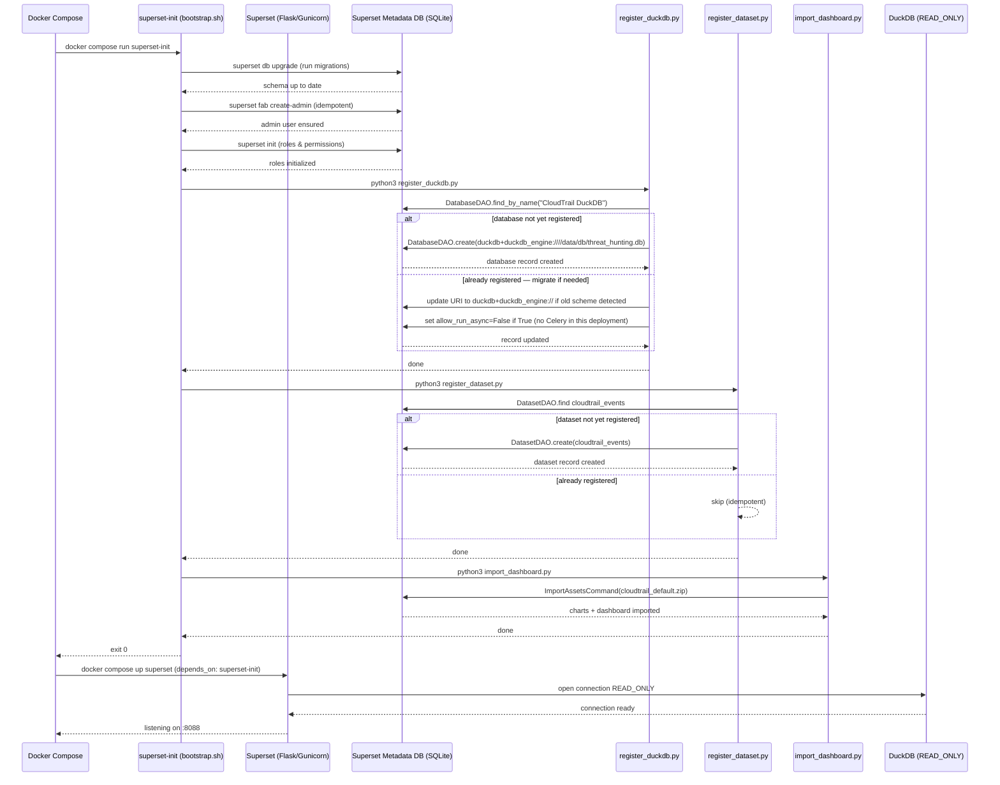
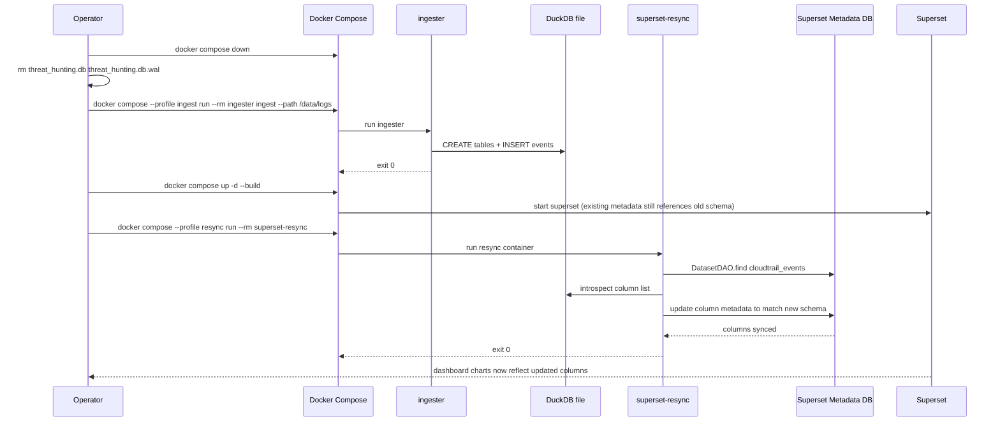

# dashboard

BI dashboard module for Senrigan powered by Apache Superset.
Visualizes CloudTrail log data stored in DuckDB. Always opens DuckDB in **`READ_ONLY`** mode.

---

## Table of Contents

- [Quick Start](#quick-start)
- [Initialization Flow](#initialization-flow)
  - [Sequence Diagram — First Startup](#sequence-diagram--first-startup)
  - [Sequence Diagram — Re-ingest & Resync](#sequence-diagram--re-ingest--resync)
- [Pre-built Charts](#pre-built-charts)
- [Suzaku Dashboards](#suzaku-dashboards)
- [Directory Structure](#directory-structure)
- [Configuration](#configuration)
- [Development](#development)
- [Troubleshooting](#troubleshooting)

---

## Quick Start

```bash
# Run from docker/

# 1. (First time) Ingest logs
docker compose --profile ingest run --rm ingester ingest --path /data/logs

# 2. Start the dashboard
docker compose up -d superset
```

Open http://localhost:8088 (default credentials: `admin` / `admin`).

> **Security:** Set `SUPERSET_SECRET_KEY` before starting Superset (or run `make ensure-secret`, which writes a per-install key to `docker/.env`). Change the admin password before exposing
> the service outside localhost.

---

## Initialization Flow

On first startup, the `superset-init` service runs automatically before
`superset` is started. All steps are **idempotent** — safe to re-run.

### Sequence Diagram — First Startup



---

### Sequence Diagram — Re-ingest & Resync

After re-ingesting logs from scratch, the dashboard's column metadata
may go stale. The `superset-resync` profile re-syncs the dataset.



---

## Pre-built Charts

The `cloudtrail_default.zip` import bundle contains **73 charts** across 9 tabs.

| Tab | Charts | Key Content |
|-----|:------:|-------------|
| 🔑 Identity & Access | 11 | Console logins · MFA trend · login heatmap · root usage · IAM entity activity · privilege escalation · Glue/SageMaker privesc · AssumedRole from external IP · secrets access anomaly · sensitive APIs · SSO events |
| 🎯 Threat Detection | 9 | Defense evasion · VPC flowlog/Config tampering · EventBridge/CloudWatch tampering · WAF changes · Org/SCP changes · error trend · throttling spikes · event timeseries |
| 📊 API Activity | 5 | Top API calls · access denied actions · region activity · source IPs · user agents |
| 🌐 Network | 5 | Security group changes · NACL/route table changes · VPC infrastructure · VPC peering/Transit Gateway · Route53 DNS changes |
| 🖥️ Computing | 13 | EC2 launches · mass stop/terminate · key pair · instance profile · user data · public snapshot · spot fleet abuse · ECS task definition backdoor · Lambda backdoor · SSM execution · EBS direct API · EKS/ECR events · CloudFormation changes |
| 🪣 S3 & RDS | 11 | S3 bulk download/deletion · versioning/logging disabled · cross-account replication · bucket policy · list recon · protection config · AWS Backup tampering · KMS key destruction · RDS snapshot share · RDS deleted without snapshot |
| 🌍 GeoIP Intelligence | 4 | World map · top countries/cities/ASNs (requires MaxMind GeoLite2) |
| 🕒 Temporal Analysis | 7 | Velocity spikes · dormant accounts reactivated · first/last seen per identity/IP/API/user-agent/service source |
| 🚨 High-Risk API Monitor | 7 | HRM timeseries · top calls/actors/IPs · by region · defense evasion table · credential access table |
All charts are backed by the `cloudtrail_events` dataset and respect
Superset's native time-range and filter bar controls.

### Rare Events dashboard

A second dashboard, **CloudTrail Threat Hunting — Rare Events**
(`cloudtrail_rare.zip`), mirrors the exact tab/chart layout of the default
**CloudTrail Threat Hunting — Top Events** dashboard but flips every frequency-ranked chart to **ascending (bottom-N)
order**, surfacing the least frequent — and therefore potentially most
anomalous — values. It is generated from `cloudtrail_default/` by
`assets/rebuild_rare_zip.py` (never edited by hand): chart/dashboard uuids
are derived deterministically via `uuid5`, slice names get a ` (Rare)`
suffix, and charts without an ordering knob (KPI cards, timeseries, world
map, heatmap) are mirrored unchanged. Both dashboards share the same
database and dataset objects.

---

## Suzaku Dashboards

Three further dashboards visualize the output of
[Suzaku](https://github.com/Yamato-Security/suzaku), Yamato Security's CloudTrail
detection engine. Senrigan reads Suzaku's DuckDB output **as-is** — nothing is
imported into `threat_hunting.db`, and the files are only ever opened read-only.

| Dashboard | Bundle | Suzaku command | Charts |
|-----------|--------|----------------|:------:|
| Suzaku Detection Timeline | `suzaku_timeline.zip` | `aws-ct-timeline` | 0 — empty template, charts land in a follow-up change |
| Suzaku Identity Summary | `suzaku_summary.zip` | `aws-ct-summary` | 18 across Overview / Identities / API Abuse / Attributes |
| Suzaku Field Metrics | `suzaku_metrics.zip` | `aws-ct-metrics` | 15 across Overview / Distribution / Rare & Temporal / GeoIP |

### Setting them up

```bash
# 1. Run Suzaku, writing DuckDB output
suzaku aws-ct-timeline -d <cloudtrail-logs> -o timeline.duckdb
suzaku aws-ct-summary  -d <cloudtrail-logs> -o summary.duckdb
suzaku aws-ct-metrics  -d <cloudtrail-logs> -f eventName -o metrics.duckdb --geo-ip  # --geo-ip is required

# 2. Copy the results next to Senrigan's own database
cp *.duckdb docker/data/db/

# 3. Restart so superset-init registers the new databases
make up
```

`make status` reports which Suzaku files it can see.

### How the connection is resolved

File names are arbitrary, so `init/register_suzaku_dbs.py` reads the producing
command from the file's own **`suzaku_meta`** table and registers one Superset
database per command under a fixed name and UUID:

| Suzaku command | Superset database |
|----------------|-------------------|
| `aws-ct-timeline` | `Suzaku Timeline DuckDB` |
| `aws-ct-summary` | `Suzaku Summary DuckDB` |
| `aws-ct-metrics` | `Suzaku Metrics DuckDB` |

Registration runs **twice**: once before the datasets are created, and once after
the dashboard ZIPs are imported. The second run matters — importing a bundle
re-applies its `databases/*.yaml` onto the existing connection (matched by UUID),
which would otherwise replace the detected path with the YAML's placeholder and
make every chart fail with an IOError. A bundle whose database was not detected is
not imported at all, so no connection is ever left pointing at a missing file.

Because the datasets reference the database by UUID, re-running Suzaku under a
different file name only rewrites a stored URI — no asset changes. When several
files match one command the newest wins; `SUZAKU_TIMELINE_DB` /
`SUZAKU_SUMMARY_DB` / `SUZAKU_METRICS_DB` pin a specific file. A bundle whose
database was not detected is not imported, so an analyst with only one Suzaku
file does not get dashboards full of errors.

A file whose `suzaku_meta.schema_version` is newer than this release understands
is skipped rather than registered — misreading a renamed column silently is worse
than a missing dashboard.

The same detection runs in the agent (`agent/suzaku_db.py`); Superset cannot
import that package, so the detection constants exist twice and
`tests/test_suzaku_detection_parity.py` keeps the copies identical.

### Why the datasets are virtual

Suzaku's DuckDB output is typed at the source since `schema_version` 1 — real
`TIMESTAMP`s, an ordered `suzaku_level` ENUM, `NULL` instead of `'-'`, and
`IsAbused` / `Outcome` / `EventSource` as their own columns — so the datasets no
longer cast or unpack anything. Two reasons to stay **virtual** (`sql:`) remain:

- PascalCase columns are renamed to snake_case, so chart params look like the
  `cloudtrail_events` charts.
- `VARCHAR[]` columns (`Tactics`, `TechniqueIDs`, `OtherTags`, `UserTypes`) are
  joined into strings — Superset cannot group by a list.

`suzaku_summary_identities` additionally pivots the per-API-call counts of
`summary_api_calls` into one row per identity.

[doc/PLAN_SUZAKU_SCHEMA.md](../doc/PLAN_SUZAKU_SCHEMA.md) records the schema and
which proposals upstream adopted.

The metrics dashboard is deliberately **field-agnostic**: Suzaku counts whichever
field it was given (`-f`), so no chart filters on a literal field name and the
`Field` native filter drives everything.

> **The metrics dashboard requires `--geo-ip`.** Suzaku writes `SrcASN`,
> `SrcCity` and `SrcCountry` to `metrics` only for a GeoIP-enriched run, and
> `suzaku_metrics` selects them, so a file produced without `--geo-ip` makes
> every chart on that dashboard fail. Run
> `suzaku aws-ct-metrics -d <logs> -o metrics -t duckdb --geo-ip`.

---

## Directory Structure

```
dashboard/
├── Dockerfile                          # Extends apache/superset:6.1.0 + duckdb-engine (uv)
├── superset_config.py                  # Superset Flask config (SECRET_KEY, DB URI, dialect registration)
├── assets/
│   ├── cloudtrail_default.zip          # Superset import ZIP (charts + dashboard + dataset)
│   ├── cloudtrail_rare.zip             # Rare Events dashboard ZIP (generated, ascending order)
│   ├── suzaku_timeline.zip             # Suzaku aws-ct-timeline bundle (empty template)
│   ├── suzaku_summary.zip              # Suzaku aws-ct-summary bundle (18 charts)
│   ├── suzaku_metrics.zip              # Suzaku aws-ct-metrics bundle (15 charts)
│   ├── zip_builder.py                  # Shared deterministic ZIP packaging
│   ├── rebuild_zip.py                  # Regenerate cloudtrail_default.zip from cloudtrail_default/
│   ├── rebuild_rare_zip.py             # Derive cloudtrail_rare.zip from cloudtrail_default/
│   ├── rebuild_suzaku_timeline_zip.py  # Regenerate suzaku_timeline.zip
│   ├── rebuild_suzaku_summary_zip.py   # Regenerate suzaku_summary.zip
│   ├── rebuild_suzaku_metrics_zip.py   # Regenerate suzaku_metrics.zip
│   ├── suzaku_timeline/                # Suzaku timeline definitions (charts/ empty by design)
│   ├── suzaku_summary/                 # Suzaku summary definitions (3 virtual datasets)
│   ├── suzaku_metrics/                 # Suzaku metrics definitions (field-agnostic)
│   └── cloudtrail_default/             # Source-of-truth dashboard definitions
│       ├── dashboard.yaml              # 9-tab layout, 72 CHART position entries
│       ├── metadata.yaml
│       ├── databases/
│       │   └── CloudTrail_DuckDB.yaml  # duckdb+duckdb_engine:// URI, allow_run_async: false
│       ├── datasets/
│       └── charts/                     # 73 chart YAML files (DSH-01 to DSH-78)
├── init/
│   ├── bootstrap.sh                    # Idempotent init script (runs in superset-init)
│   ├── register_duckdb.py              # Register DuckDB connection; auto-migrates old URI/settings
│   ├── register_suzaku_dbs.py          # Detect Suzaku *.duckdb by schema; register one DB per command
│   ├── register_dataset.py             # Register cloudtrail_events dataset
│   └── import_dashboard.py             # Import a dashboard ZIP via ImportAssetsCommand (DASHBOARD_ZIP env)
└── tests/
    ├── test_chart_yaml.py
    ├── test_dashboard_yaml.py
    ├── test_dockerfile.py
    ├── test_import_dashboard.py
    ├── test_init_scripts.py
    ├── test_rare_generator.py
    ├── test_rare_zip.py
    ├── test_rebuild_zip.py
    ├── test_suzaku_signatures.py
    ├── test_suzaku_bundles.py
    ├── test_rebuild_suzaku_zips.py
    └── test_superset_config.py
```

---

## Configuration

| Variable | Default | Description |
|----------|---------|-------------|
| `SUPERSET_SECRET_KEY` | auto-generated | Session signing key; `make up` generates a per-install value into `docker/.env` (Superset refuses to start without one) |
| `SUPERSET_ADMIN_USERNAME` | `admin` | Admin username |
| `SUPERSET_ADMIN_PASSWORD` | `admin` | Admin password (**must change in production**) |
| `DUCKDB_PATH` | `/data/db/threat_hunting.db` | DuckDB file path (in container) |
| `DUCKDB_HOST_PATH` | `./data/db` | Host-side DuckDB directory (bind mount) |
| `SUZAKU_TIMELINE_DB` | — | Pin one Suzaku timeline file instead of auto-detecting |
| `SUZAKU_SUMMARY_DB` | — | Pin one Suzaku summary file instead of auto-detecting |
| `SUZAKU_METRICS_DB` | — | Pin one Suzaku metrics file instead of auto-detecting |

### Key design decisions

| Setting | Value | Reason |
|---------|-------|--------|
| `allow_run_async` | `False` | No Celery worker in this deployment. `True` causes SQL Lab Issue 1035: *"Failed to start remote query on a worker."* |
| SQLAlchemy URI | `duckdb+duckdb_engine:////…` | Explicit driver suffix bypasses SQLAlchemy 2.x entry-point auto-discovery, preventing *"Can't load plugin: sqlalchemy.dialects:duckdb.duckdb_engine"* |
| `registry.register()` | both `"duckdb"` and `"duckdb.duckdb_engine"` | SA2 normalizes `+` → `.` when looking up dialect; both keys must be registered to cover all URI forms |
| Base image | `apache/superset:6.1.0` | SQLAlchemy 2.x support |
| Package install | `uv pip install --python /app/.venv` | Superset 6.x uses a uv-managed venv that has no `pip` module; bare `pip install` installs to the wrong Python |

---

## Development

```bash
cd docker

# Build the custom Superset image
docker compose build superset

# Verify duckdb-engine is installed in the image
docker compose run --rm superset python -c "import duckdb_engine; print('OK')"

# Re-run initialization (idempotent — safe to run multiple times)
docker compose run --rm superset-init

# Fix blank / stale charts after re-ingest
docker compose --profile resync run --rm superset-resync
```

### Modifying dashboard definitions

Superset never reads the bundle YAML directly — it only applies the compiled ZIP,
so editing YAML without rebuilding leaves the running dashboard silently stale.
`tests/test_rebuild_suzaku_zips.py` fails when a Suzaku ZIP is out of date.

1. Edit YAML files under `dashboard/assets/<bundle>/`.
2. Regenerate the affected ZIP(s):
   ```bash
   cd dashboard/assets
   python3 rebuild_zip.py                    # cloudtrail_default.zip
   python3 rebuild_rare_zip.py               # cloudtrail_rare.zip (derived)
   python3 rebuild_suzaku_timeline_zip.py    # suzaku_timeline.zip
   python3 rebuild_suzaku_summary_zip.py     # suzaku_summary.zip
   python3 rebuild_suzaku_metrics_zip.py     # suzaku_metrics.zip
   ```
3. Re-run initialization to import the updated ZIPs:
   ```bash
   cd docker
   docker compose run --rm superset-init
   ```

### Running tests

```bash
cd dashboard
python3 -m pytest tests/ -v
```

The test suite (738 tests) covers:
- `test_chart_yaml.py` — required fields and dataset UUID in all chart YAMLs
- `test_dashboard_yaml.py` — layout structure, cross-references, native filters
- `test_dockerfile.py` — base image version, duckdb-engine constraint, uv install, build-time import check
- `test_import_dashboard.py` — query_context orderby direction honors `order_desc`
- `test_init_scripts.py` — URI scheme, `allow_run_async` absence, idempotent migration logic, rare-dashboard import
- `test_rare_generator.py` — Rare Events transformation rules (uuid derivation, order flip, layout preservation)
- `test_rare_zip.py` — Rare Events ZIP structure, ascending semantics, byte determinism
- `test_rebuild_zip.py` — ZIP structure and chart coverage
- `test_superset_config.py` — feature flags, dialect registration
- `test_suzaku_signatures.py` — `suzaku_meta`-based detection of Suzaku output, read-only URI contract
- `test_suzaku_bundles.py` — bundle layout, UUID uniqueness, and every dataset/chart
  expression executed for real against the committed Suzaku fixtures
- `test_rebuild_suzaku_zips.py` — Suzaku ZIP structure, byte determinism, staleness

The CI pipeline (`dashboard-yaml` job) validates all YAML files and verifies
that the ZIP contains all required files on every push.

---

## Troubleshooting

### SQL Lab: "Failed to start remote query on a worker" (Issue 1035)

**Cause:** The database connection was registered with `allow_run_async=True`, which
tells Superset to submit SQL Lab queries to a Celery worker. This deployment has no
Celery worker or Redis broker, so the submission fails immediately.

**Fix (automatic):** `register_duckdb.py` detects `allow_run_async=True` on existing
database connections and sets it to `False` at every `superset-init` run.

**Manual fix** (if needed):
1. Open Superset → **Settings** → **Database Connections**
2. Edit **CloudTrail DuckDB**
3. In **Advanced** → uncheck **Allow Asynchronous Query Execution**
4. Save

---

### "Can't load plugin: sqlalchemy.dialects:duckdb.duckdb_engine"

**Cause:** SQLAlchemy 2.x normalizes the URI driver separator (`duckdb+duckdb_engine://`
→ lookup key `duckdb.duckdb_engine`) and falls back to entry-point discovery, which
can fail depending on importlib.metadata cache state.

**Fix:** `superset_config.py` explicitly registers both dialect keys:
```python
registry.register("duckdb", "duckdb_engine", "Dialect")
registry.register("duckdb.duckdb_engine", "duckdb_engine", "Dialect")
```
This is applied at Superset startup and requires no user action.

---

### "No module named 'duckdb_engine'" at Docker build time

**Cause:** Superset 6.x uses a uv-managed virtual environment at `/app/.venv`.
The venv intentionally omits `pip`, so `pip install` and `python3 -m pip install`
fail or install to the wrong location.

**Fix:** The Dockerfile uses `uv pip install --python /app/.venv` to install
directly into the venv:
```dockerfile
RUN uv pip install --python /app/.venv --no-cache-dir "duckdb-engine>=0.14.0"
RUN python3 -c 'import duckdb_engine'   # build-time verification
```
