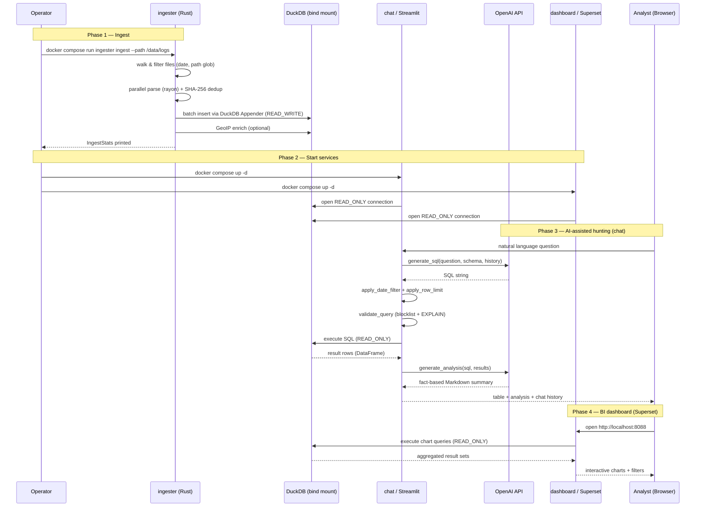

# Architecture

## Language Policy

All architectural documentation, comments, and code annotations in this project MUST be written in English.

## System Overview

Senrigan is a locally-executed, AI-assisted threat hunting tool for AWS CloudTrail logs.
Four services do the work, orchestrated by Docker Compose and sharing one bind-mounted
directory. Two more exist and are not long-lived containers: `superset-init` runs once on
every `up` to import the dashboard bundles, and `superset-resync` runs on demand behind the
`resync` profile. See [Docker Compose Services](#docker-compose-services).

That mounted directory holds more than one database. `threat_hunting.db` is the one
Senrigan writes; alongside it sit any number of read-only `*.duckdb` files produced by
[Suzaku](https://github.com/Yamato-Security/suzaku), which the readers open as-is.

```
┌──────────────────────────────────────────────────────────────────────┐
│                          Docker Compose                              │
│                                                                      │
│  ┌────────────┐  ┌────────────┐  ┌──────────────┐  ┌─────────────┐   │
│  │  ingester  │  │   agent    │  │  config_viz  │  │  dashboard  │   │
│  │  (Rust)    │  │ (Streamlit)│  │(FastAPI+     │  │  (Superset) │   │
│  │            │  │            │  │  React)      │  │             │   │
│  │ CloudTrail │  │ AI-Agent   │  │ AWS Config   │  │  BI / Viz   │   │
│  │ gz ingest  │  │ SQL gen/   │  │ Resource     │  │             │   │
│  │ Config     │  │ exec       │  │ Graph        │  │             │   │
│  │ import     │  │ 2 pages    │  │              │  │ 5 dashboards│   │
│  │ READ_WRITE │  │ READ_ONLY  │  │ READ_ONLY    │  │  READ_ONLY  │   │
│  └─────┬──────┘  └──┬──────┬──┘  └──────┬───────┘  └──┬───────┬──┘   │
│        │            │      │            │             │       │      │
│        └────────────┴──────┼────────────┴─────────────┘       │      │
│                            │                                  │      │
│                  ┌─────────▼─────────┐          ┌─────────────▼────┐ │
│                  │ threat_hunting.db │          │  suzaku *.duckdb │ │
│                  │  1 writer / N     │          │  third-party,    │ │
│                  │  readers          │          │  never written   │ │
│                  └───────────────────┘          └──────────────────┘ │
│                       docker/data/db/  (bind mount, SSD recommended) │
└──────────────────────────────────────────────────────────────────────┘
```

## Module Responsibilities

### ingester (Rust)

**Purpose:** Parse AWS CloudTrail JSON/gz log files and AWS Config snapshots from the local
filesystem and store them in DuckDB.

- Sole writer to DuckDB (`READ_WRITE` mode)
- Runs as a one-shot CLI command (Docker Compose profile: `ingest`)
- Handles gz decompression, JSON parsing, schema creation, and batch insertion
- Three subcommands: `ingest`, `enrich`, `config-import`
- Targets: 10 GB in under 5 minutes, 50 GB on 16 GB RAM

### agent (Python / Streamlit)

**Purpose:** AI-assisted interactive threat hunting UI.

- Reads from DuckDB (`READ_ONLY` mode)
- Generates SQL from natural language via OpenAI API
- Executes queries and displays results
- Generates threat hunting reports (Markdown / PDF)
- Four-page Streamlit app (`st.navigation`), in two shapes:
  - *Chat pages*, driven by one shared pipeline that has the LLM write the SQL:
    - **🔭 Senrigan** — hunting over `cloudtrail_events` (DuckDB + OpenAI)
    - **🕒 Suzaku Timeline** — the same UI over the `timeline` table of a
      [Suzaku](https://github.com/Yamato-Security/suzaku) `aws-ct-timeline` export
  - *Explorer pages*, which run only reviewed SQL that ships with Senrigan:
    - **👤 Suzaku Summary** — identity triage and drill-down over `aws-ct-summary`
    - **📊 Suzaku Metrics** — field explorer over `aws-ct-metrics`
- A `DatasetProfile` (`agent/profiles.py`) carries everything table-specific — table
  name, time column, filter CTE, severity column, system prompt, hunts YAML and the
  session-state namespace — so no page duplicates the pipeline.

#### Chat pages and explorer pages

The two shapes exist because the input differs, not the taste. `cloudtrail_events` and
Suzaku's `timeline` are raw and high-cardinality: the question is unknown in advance, so
an LLM writing SQL earns its cost. `aws-ct-summary` and `aws-ct-metrics` are **already
aggregated by Suzaku** — 22 identities, 1,344 counted values in the reference data — so
generating SQL over them would add cost and a hallucination surface while removing
nothing.

An explorer page therefore has no hunts YAML, no system prompt and no generated SQL.
Every statement it runs is a reviewed, parameterized query in
`agent/suzaku_summary_queries.py` / `agent/suzaku_metrics_queries.py`; those modules
import no Streamlit, so they are unit-tested against the committed fixtures directly.
Their profiles set `chat_enabled=False`, and `build_system_prompt()` / `hunts_path`
**raise** for them — an explorer profile reaching the chat pipeline is a bug that should
fail a test, not ship an empty prompt to OpenAI.

What the explorer pages add over the equivalent Superset dashboard is the part a
dashboard structurally cannot do: a selection that decides which panels even exist, live
Top-N / minimum-count / search controls, set comparison between two identities or two
fields, 📌 pinning any panel into the same Markdown/HTML report the chat pages produce,
and a 🕒 pivot that hands a prepared statement to the timeline page (through its existing
direct-SQL hook, so it needs no API key).

#### Suzaku output as a third-party read-only input

Suzaku writes `*.duckdb` files that an analyst copies into the same mounted database
directory. Senrigan reads them as-is: the ingester never touches them and no reader
opens them writable, so the 1-writer / N-readers invariant is unchanged and re-running
Suzaku needs no re-ingest.

Every file carries a one-row `suzaku_meta` table naming the command that wrote it and
the `schema_version` of the layout, so the producing command is read rather than
guessed, and a file from a layout Senrigan does not know is refused instead of
mis-visualized. That read exists twice because the two consumers resolve paths at
different times — the agent globs on every Streamlit rerun, while Superset stores one
path per database connection, resolved once by `superset-init`:

| Consumer | Detection lives in | Resolves |
|----------|-------------------|----------|
| `agent` | `agent/suzaku_db.py` | at runtime, per rerun |
| `dashboard` | `dashboard/init/register_suzaku_dbs.py` | once, at bootstrap |

The Superset image cannot import the agent package. `docker/docker-compose.yml` therefore
bind-mounts `agent/suzaku_db.py` into `superset-init` and `superset-resync`, and
`register_suzaku_dbs.py` imports it, so there is one implementation rather than two copies;
`tests/test_suzaku_detection_shared.py` fails if that wiring is undone.

##### Choosing between several files

A directory routinely ends up holding more than one file for the same Suzaku command — a
re-run, a second account, a colleague's export. Exactly one wins per command, chosen by
`generated_at` (when Suzaku ran) → mtime → path, so the agent and the dashboard always land
on the same file without coordinating.

A file is a candidate only if it carries every column the shipped datasets select
(`REQUIRED_COLUMNS`). This is why the Suzaku Field Metrics dashboard needs a run with
`--geo-ip`: without it Suzaku omits `SrcASN` / `SrcCity` / `SrcCountry`, and the file is
rejected with that reason rather than registered and left to fail at render time. Each
Suzaku dashboard carries a **Suzaku Run Info** card naming its own `source_file`, each
explorer page carries the same panel, and `make status` / `make up` print which file won
and which candidates lost.

Fitness is about the columns *existing*, which is not the same as their being populated:
a `--geo-ip` run can still write `SrcASN` / `SrcCity` / `SrcCountry` as all-NULL. The
Metrics explorer therefore asks separately (`has_geo_data`) and explains the absence
instead of drawing three empty charts.

### config_viz (Python / FastAPI + React)

**Purpose:** Interactive AWS Config resource graph viewer.

- Reads from DuckDB (`READ_ONLY` mode)
- FastAPI backend exposes 4 REST endpoints for graph data
- React 18 + Vite + TypeScript frontend renders hierarchical resource graph
  - `reactflow` for graph rendering, `elkjs` (ELK layered / Sugiyama algorithm) for auto-layout
    — migrated from `@dagrejs/dagre`
  - Container nesting: VPC / Subnet / EC2 shown as nested, collapsible boxes
  - Service-color legend and click-to-inspect detail panel with full configuration and tags
- Port 8502

### dashboard (Apache Superset)

**Purpose:** BI dashboard for log visualization.

- Reads from DuckDB (`READ_ONLY` mode)
- Pre-seeded with five dashboards imported from versioned asset bundles:
  - **CloudTrail Default** (101 charts) and **Rare Events**, derived from the same
    definitions with ascending / bottom-N ordering
  - **Suzaku Detection Timeline** (46), **Suzaku Identity Summary** (19) and
    **Suzaku Field Metrics** (15), each over a Suzaku `*.duckdb` file
- Supports ad-hoc SQL visualization (SQL Lab)
- Superset never reads the YAML definitions directly — it imports the compiled ZIPs, so a
  YAML edit takes effect only after a rebuild and a re-run of `superset-init`
- Port 8088

## DuckDB Sharing Strategy

### Decision: Docker Bind Mount + 1-Writer / N-Readers

DuckDB is an in-process database. It does not support concurrent writes from multiple processes. However, multiple `READ_ONLY` connections are permitted while one process holds the write lock.

```
┌───────────────────────────────────────────────────────────────┐
│         Bind Mount: docker/data/db/threat_hunting.db           │
│         Mounted on host NVMe/SSD (recommended)                 │
└─────────┬──────────────────────┬─────────────────────────────-┘
          │ READ_WRITE (1)        │ READ_ONLY (multiple)
          ▼                       ▼
       ingester           agent / config_viz / dashboard
     (write only)              (read only)
```

### Access Rules

1. `ingester` opens the database as `READ_WRITE` — it is the exclusive writer.
2. `agent`, `config_viz`, and `dashboard` open the database as `READ_ONLY` — they are concurrent readers.
3. The default workflow is sequential: ingester completes ingestion first, then read-only services query.
4. Suzaku's `*.duckdb` files are opened `READ_ONLY` by every service, including `ingester`,
   which never writes to them at all.
5. SSD storage (SATA or NVMe) is strongly recommended; HDD is discouraged.

### Alternatives Considered

| Option                         | Performance | Concurrency    | Complexity | Decision     |
| ------------------------------ | ----------- | -------------- | ---------- | ------------ |
| **Bind Mount (host path)**     | ◎           | 1W / nR        | Low        | **Adopted**  |
| Named Volume + READ_ONLY       | ◎           | 1W / nR        | Low        | Rejected     |
| DuckLake extension             | ○           | Multiple W     | High       | v2+ consider |
| Arrow Flight proxy             | △           | Multiple W     | High       | Rejected     |
| NAS / network storage          | ✕           | ✕              | Low        | Rejected     |

The bind mount was chosen over a named volume for a portability reason rather than a
performance one: Docker on Linux/WSL2 misresolves relative paths in named-volume
`driver_opts`, so each service declares its own `volumes:` entry against a host path.

## Data Flow

```
CloudTrail logs (.json / .json.gz)    AWS Config snapshots (.json)
        │                                       │
        ▼                                       ▼
┌───────────────────────────────────────────────────────┐
│  ingester                                             │
│                                                       │
│  ingest subcommand          config-import subcommand  │
│  1. Walk dir                1. Walk dir               │
│  2. Detect gz ──→ flate2    2. SHA-256 dedup          │
│  3. Parse JSON ──→ serde    3. Parse snapshot JSON    │
│  4. Insert DB ──→ DuckDB    4. Insert snapshots /     │
│  5. Track  ──→ SHA-256 dedup   resources / edges      │
└──────────────────────┬────────────────────────────────┘
                       │ DuckDB READ_WRITE
                       ▼
             ┌─────────────────┐
             │     DuckDB      │
             │  threat_        │
             │  hunting.db     │
             └────────┬────────┘
                      │ DuckDB READ_ONLY
          ┌───────────┴──────────────────────┐
          ▼                    ▼             ▼
┌──────────────┐  ┌──────────────────┐  ┌────────────────┐
│  agent       │  │  config-viz      │  │  dashboard     │
│              │  │                  │  │                │
│  User query  │  │ FastAPI backend  │  │ Pre-built      │
│  → AI → SQL  │  │ React 18 SPA     │  │ charts/tables  │
│  → Execute   │  │ Resource graph   │  │                │
│  → Analyze   │  │ (port 8502)      │  │ (port 8088)    │
│  → Report    │  │                  │  │                │
└──────────────┘  └──────────────────┘  └────────────────┘
```

## CloudTrail Table Schema

The ingester creates and populates `cloudtrail_events` with **48 columns** (17 core + 7 GeoIP + 24 extended).  
JSON blobs are stored as **`VARCHAR`**, not DuckDB JSON type — use `json_extract_string()` to query them.

See the full schema definition in [AGENTS.md](../AGENTS.md#duckdb-schema).

### Schema Design Decisions

| Decision                                  | Rationale                                                                |
| ----------------------------------------- | ------------------------------------------------------------------------ |
| Flatten `userIdentity` fields             | Most queries filter/group by identity type, ARN, or account ID           |
| Store `request/response` as VARCHAR       | Too varied to normalize; use `json_extract_string()` for ad-hoc access   |
| Store `raw_event` as VARCHAR              | Preserves the original record; fields not in schema remain accessible    |
| Use `TIMESTAMP` for `event_time`          | Enables native time-range queries and DuckDB temporal functions          |
| No primary key                            | DuckDB does not enforce PK constraints; dedup via `ingested_files` table |
| GeoIP columns added via `ALTER TABLE`     | Idempotent; columns absent when ingested without GeoLite2 (remain NULL)  |

## Docker Compose Services

| Service            | Port  | Volume Access | Description                                  |
| ------------------ | ----- | ------------- | -------------------------------------------- |
| `ingester`         | —     | READ_WRITE    | CLI log ingestion (profile: `ingest`)        |
| `agent`            | 8501  | READ_ONLY     | Streamlit AI hunting UI                      |
| `config-viz`       | 8502  | READ_ONLY     | AWS Config resource graph (FastAPI + React)  |
| `superset`         | 8088  | READ_ONLY     | Apache Superset BI dashboard                 |
| `superset-init`    | —     | —             | One-shot Superset initialization             |
| `superset-resync`  | —     | READ_ONLY     | Re-sync dataset metadata after re-ingest (profile: `resync`) |

### Volumes

| Volume              | Type         | Purpose                                      |
| ------------------- | ------------ | -------------------------------------------- |
| `${DUCKDB_HOST_PATH:-./data/db}` | Bind mount | Shared DuckDB database file  |
| `superset_home`     | Named volume | Superset metadata and configuration          |

> **Note:** DuckDB data uses a **bind mount** (not a named volume). Docker Engine on Linux/WSL2 misresolves relative paths for named-volume `driver_opts`, so each service declares its own `volumes:` entry with a direct bind mount.

## Security Architecture

```
┌──────────────────────────────────────────────────┐
│                  Local Machine                    │
│                                                   │
│  ┌──────────────┐    ┌─────────────────────────┐ │
│  │  .env file   │───▶│  OPENAI_API_KEY         │ │
│  │  (git-       │    │  SUPERSET_SECRET_KEY    │ │
│  │   ignored)   │    └─────────────────────────┘ │
│  └──────────────┘                                 │
│                                                   │
│  ┌──────────────┐    ┌─────────────────────────┐ │
│  │  agent       │───▶│  OpenAI API (external)  │ │
│  │  READ_ONLY   │    │  Only SQL gen requests  │ │
│  │  + EXPLAIN   │    └─────────────────────────┘ │
│  │  + keyword   │                                 │
│  │    filter     │    No other external calls     │
│  └──────────────┘                                 │
│                                                   │
│  DuckDB data never leaves the local machine       │
└──────────────────────────────────────────────────┘
```

## End-to-End Sequence Diagram

The diagram below shows the full lifecycle from log ingestion through to a
completed AI-assisted threat hunting session.



## Future Extension Points (v2.0)

### Plugin Architecture for Log Sources

```rust
// v2.0 conceptual design
pub trait LogIngester: Send + Sync {
    fn source_id(&self) -> &str;
    fn ingest(&self, input: &IngesterInput, db: &DuckDBHandle) -> Result<IngestStats>;
    fn supported_patterns(&self) -> Vec<&str>;
}
```

### Planned Plugins

| Plugin          | Target Log        | Version |
| --------------- | ----------------- | ------- |
| `cloudtrail`    | CloudTrail JSON/gz | v1.0   |
| `vpc_flowlogs`  | VPC Flow Logs      | v2.0   |
| `s3_access`     | S3 Access Logs     | v2.0   |
| `waf`           | AWS WAF Logs       | v2.0   |
| `guardduty`     | GuardDuty Findings | v2.0   |
