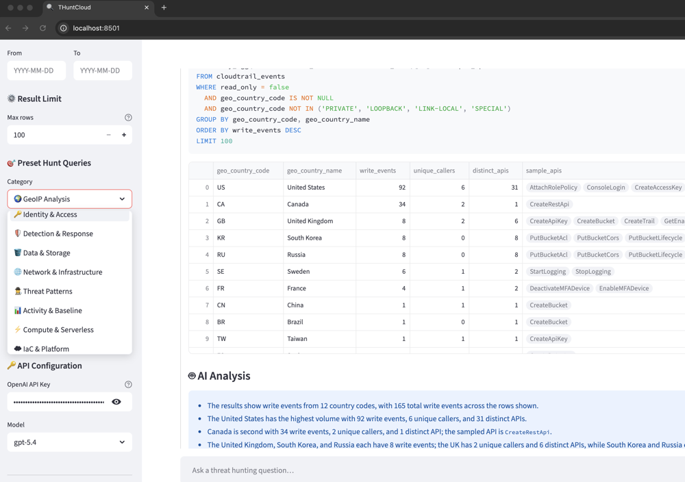
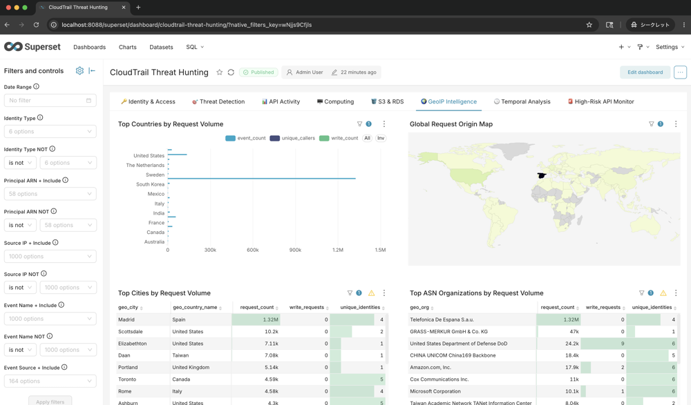
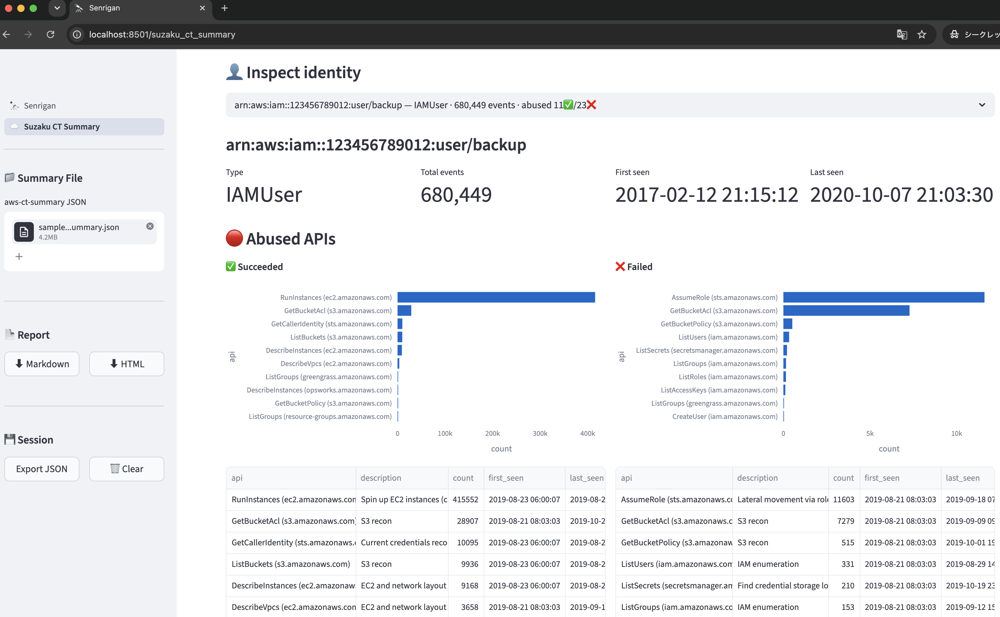
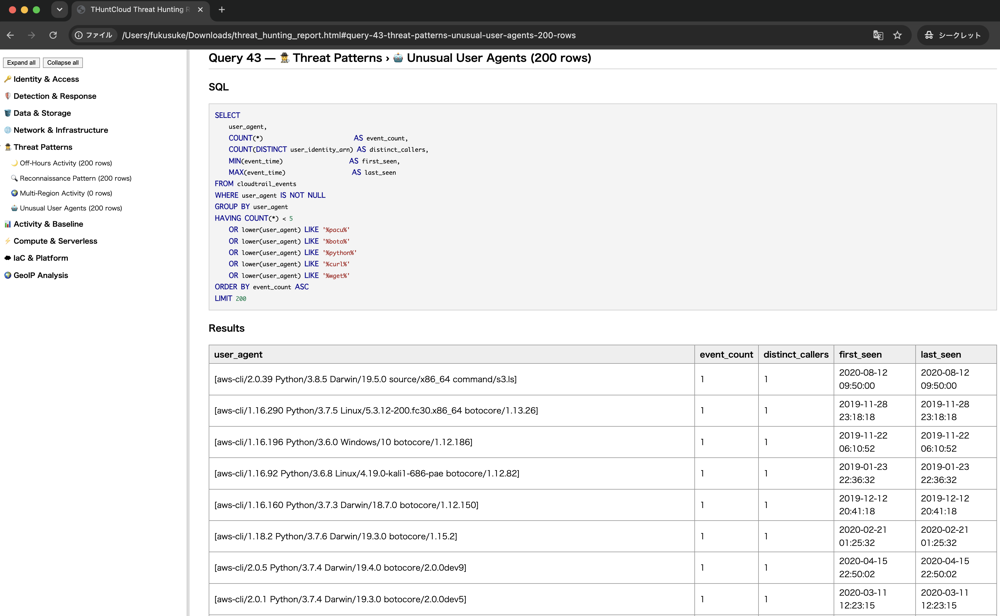
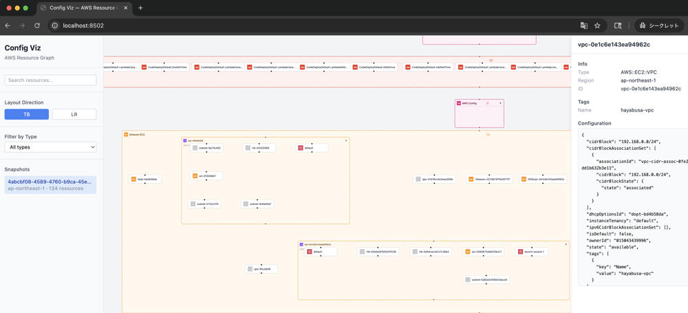

# Apa itu Senrigan?

## Buru ancaman AWS dalam hitungan menit — tanpa SIEM, tanpa infrastruktur Cloud
> Masukkan log CloudTrail Anda dan dapatkan 100+ perburuan ancaman siap pakai, dasbor BI, dan analisis berbantuan AI
> — semuanya di laptop Anda hanya dengan satu `make up`.

## Fitur Utama
## 🔍 100+ Perburuan Bawaan + Obrolan AI

## 📊 80+ Bagan Dasbor Siap Pakai

## 🦅️ Visualisasi hasil Suzaku

## 📄 Laporan Perburuan Ancaman HTML

## 🗺 Grafik Sumber Daya AWS Config

## Dirancang untuk
- 🔍 Insinyur keamanan — menyelidiki pembobolan akun AWS, eskalasi hak akses, atau eksfiltrasi data
- 🛡 Tim keamanan cloud — menjalankan tinjauan postur cloud berkala tanpa SIEM khusus
- 🧑‍💻 Pengembang & SRE — dengan cepat mengaudit riwayat CloudTrail akun mereka sendiri selama atau setelah insiden

---
